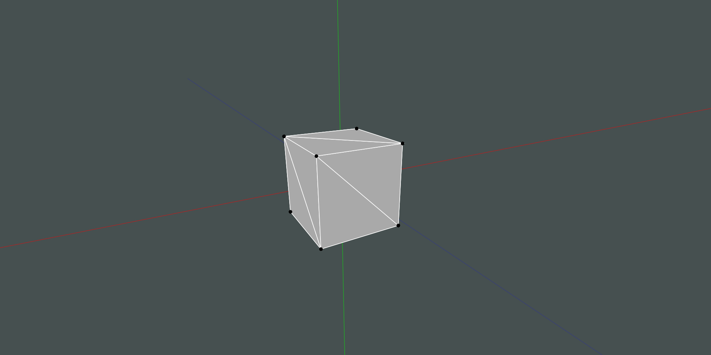

# 3D Renderer
This project renders 3-Dimensional objects using vertices and triangles to connect them.

I created this entire project by myself.

## How To Run
This project runs on javafx, but everything else is entirely from scratch. You may need to add javafx to the project dependencies.

This project needs all of the files in the `src` folder, and the `.vscode` folder if running it in VSCode. Everything else is for gitHub.

The main method is in `ThreeDimensionalScene.java`.

Here is an example run:


This is the code responsible for displaying points on the screen. It is obviously one of the most important parts of 3D rendering, and it is what inspired me to make this project in the first place.
```
	Point2D project(Point3D point, boolean isCameraCoordinates) {
		if (point == null) return null;
		Point3D convertedPoint = isCameraCoordinates ? point : camera.convertToCameraCoordinates(point);
		if (convertedPoint.getZ() < 0.001) return null;
		double x = camera.getFocalLength() / convertedPoint.getZ() * convertedPoint.getX() * WORLD_TO_SCREEN_CONVERSION + mainPane.getWidth() / 2;
		double y = camera.getFocalLength() / convertedPoint.getZ() * -convertedPoint.getY() * WORLD_TO_SCREEN_CONVERSION + mainPane.getHeight() / 2;
		return new Point2D(x, y);
    }
```

## Controls
#### Tools:
- `q`: "pan" tool (moves the camera position)
- `w`: camera rotate tool (rotates the cameras viewing plane)
- `e`: select tool (selects vertices and triangles to edit)
- `r`: move tool (moves selected vertices)

Pan tool is the default.

:arrow_right: The select (`e`) and move (`r`) tools are not currently supported. Functionality will be added later.
> Pressing `shift` while using any tool except the select tool will confine the movement of that tool to the vertical, horizontal, or diagonal directions.

#### Features:
- `0`: toggle wireframe mode (shows triangles empty instead of filled in), default: off
- `p`: toggle information pane (shows coordinates of selected vertex), default: off

### Pan Tool:
Click and drag to move the camera in the x and y directions. Scroll to move the camera in the z direction.

Pressing `up arrow` and `down arrow` zooms in and out, respectively. This feature can be useful, but generally it is more useful to just move the camera forward and backward (mouse scroll).

Scrolling and `up arrow` and `down arrow` also work with the rotate tool.

### Camera Rotate Tool:
Click and drag to rotate the camera to look in a different direction around the scene.
> Hold `alt` while dragging to rotate around the origin instead of the camera (very useful for looking at objects from different angles).

### Select Tool:
Not currently supported.

Holding `shift` while using the select tool allows you to add to your current selection instead of replacing it.

### Move Tool:
Not currently supported.

### Information Pane:
Currently shows the coordinates of the camera. Can be edited to move the camera.

:arrow_right: Will show vertex coordinates instead of camera coordinates.

## Objects
Default object is a cube. Pressing different numbers displays different objects to look at.
- `1`: Cube
- `2`: Tetrahedron (Triangular Pyramid)
- `3`: Octahedron

## Future Plans
Features I plan to add in the future:
- [ ] Allow movement of vertices (including editing in the information pane)
- [ ] Allow creation of vertices and triangles
- [ ] Icon buttons to select tools (keep keyboard shortcuts)
- [ ] Drawing axes to intersect with faces instead of always being drawn behind
- [ ] Save and load functionality to save created objects
